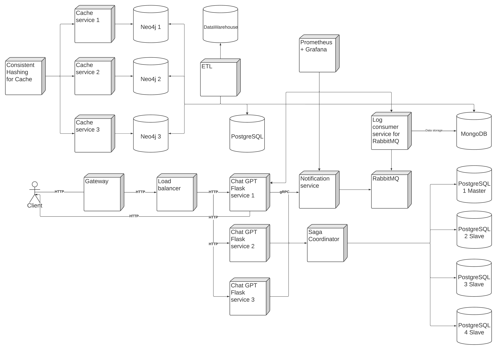
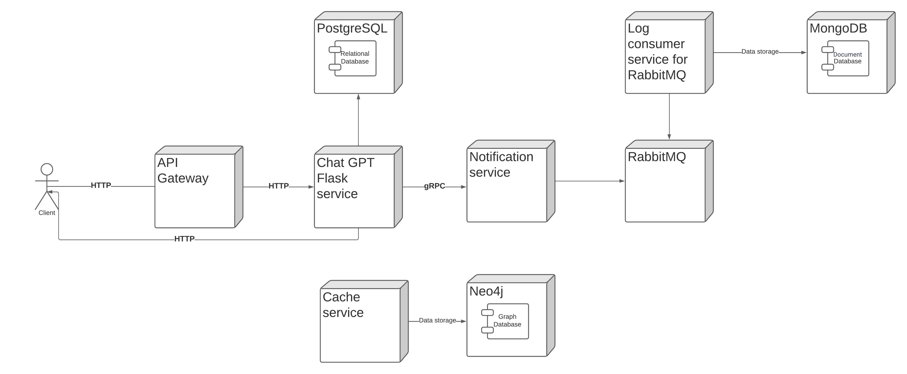
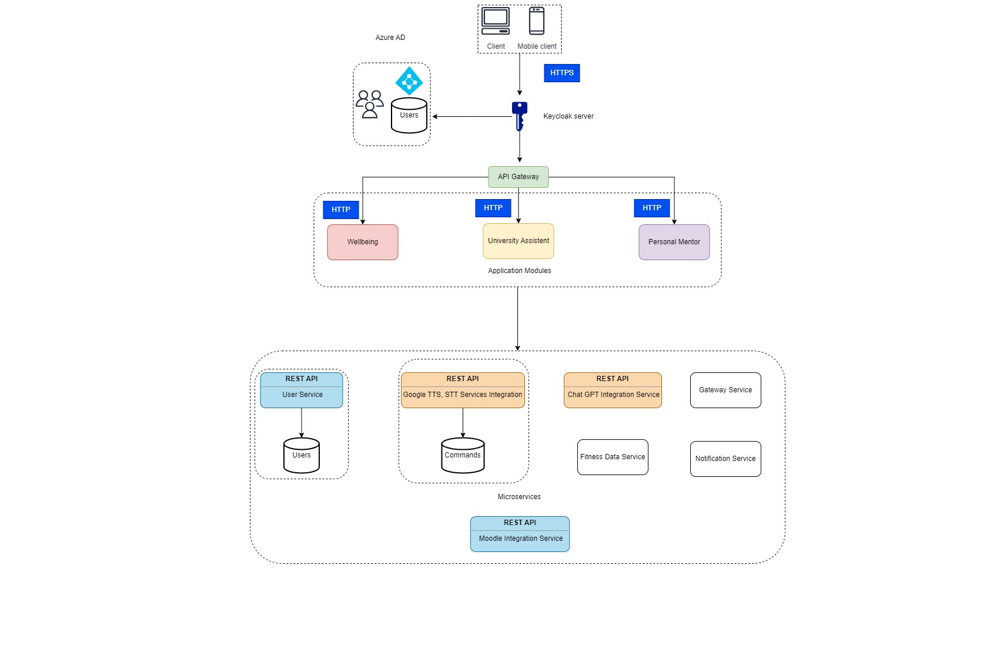
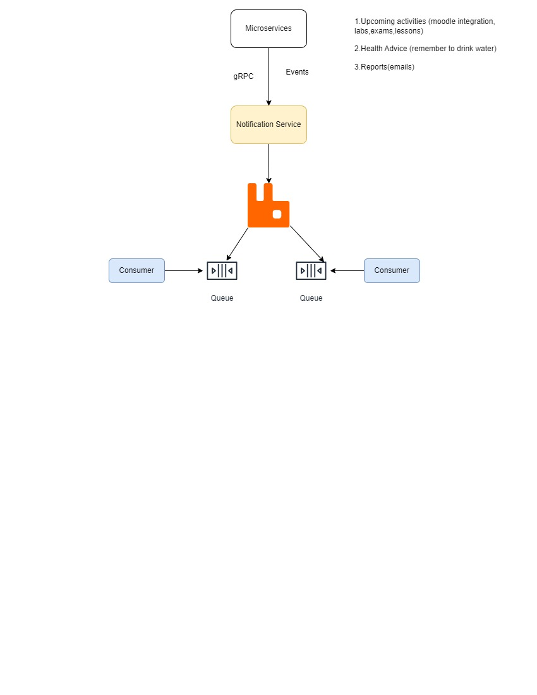

# Laboratory work Nr.1

## Student life management system within UTM.

The aim of this project is to develop a complex application that addresses several aspects of university and student life. Its main objective is to facilitate integration into the university environment, to provide support in maintaining a physical and mental well-being and to provide resources for the academic and professional development of students.

### Service Boundaries

 - Fitness data service
    - Integration with Xiaomi Mi Fitness devices to collect data on users' physical activity and health.
    - Create a scoring system and weekly summary to assess users' health and wellness progress.

- Integration with moodle
    - Implement a notification system to inform users about upcoming labs and exams.
    - Creating an absence monitoring system that calculates their estimated costs on academic performance.
    - Providing useful information about university resources, internship opportunities and information about alumni and personal mentors.

- Mentor for study
    - Development of an interface for learning and testing with flashcards, including the ability to customize and edit them.
    - Implementation of a voice recognition and text-to-speech conversion mode to facilitate users' access to learning content while on the go.
    - Creating two modes for learning cards: learning mode and test mode.
    - Integration with GPT Chat to provide additional support and answers to various questions.
    - Developing a user-friendly interface for desktop, iOS and Android.
    - Implementation of a voice recognition system and voice commands for all components of the application.


### Application Suitability

The application has multiple components, like fitness tracking, university management, and personal mentoring. These components can potentially be developed and maintained independently, making it suitable for a microservices architecture. Each module can have its own team responsible for development and updates.

### Scalability

Even though we aren’t expecting a lot of users, since we are pitching this as an application for UTM students only, as of now, in theory, this application has the capability to scale to more universities in even more countries, which means a large user base, microservices can help with scalability, making it easy to scale individual services based on demand. For instance, the fitness and wellness module might experience different usage patterns compared to the university assistant module.

### Resilience

Since our application is modular, if one service fails, it won't necessarily bring down the entire application. Users can still access other functionalities.

### Third-party Integrations

Our application needs to integrate with various third-party services and APIs (e.g., Mi Fitness, calendar services, speech-to text and text to speech services,chat gpt,etc). Microservices can make it easier to manage these integrations separately.

### Real Life examples

Our applications is pretty similar to Coursera, LinkedIn, Duolingo, MiFitness, which are similar in such matters as notifications, scheduling, progress tracking, and personalized learning. They serve as valuable examples of how technology can enhance the educational and wellness aspects of students' lives. We take inspiration from these platforms while adding a unique combination of features.

### Set Up Deployment and Scaling

Azure pipelines, and Docker.
Azure Pipelines enables you to set up a CI/CD pipeline for Dockerized application. This means that whenever changes are pushed to code repository, Azure Pipelines can automatically build new Docker images, run tests, and deploy the updated containers to target environment, ensuring a rapid and reliable release process.

Docker simplifies the deployment process. You can create a Docker image once and deploy it to multiple environments without worrying about differences in the underlying infrastructure. Azure Pipelines automates the deployment process.


### Technology Stack and Communication Patterns

python, C#, Rust -languages

REST-APIs, RabbitMQ - notifications

### System architecture diagram












## Design Data Management

### Chat GPT service endpoints:

- http://localhost:8080/chat


- POST JSON Request to ask a question to gateway:
```sh
{
  "user_email": "john.doe@example.com",
  "question": "What is the capital of Moldova?"
}
```


- JSON Response after asking a question to gateway:
```sh
{
  "response": "The capital of Moldova is Chisinau."
}
```


- http://localhost:5000/addcommand


- POST JSON Request to create a command asigned to for Question prompt(user will not ask full question but just the send the command):
```sh
{
  "command": "Moldova",
  "question": "What is the capital of Moldova?"
}
```

- JSON Response after creation of a command asigned to for Question prompt(user will not ask full question but just the send the command):
```sh
{
  "response": "Was created Moldova command for Question prompt: What is the capital of Moldova?"
}
```


- http://localhost:5000/chat


- POST JSON Request to ask a question or command to Chat GPT:
```sh
{
  "user_email": "john.doe@example.com",
  "question": "What is the capital of Moldova?"
}
```

```sh
{
  "user_email": "john.doe@example.com",
  "question": "Moldova"
}
```

- JSON Response after asking a question or command to Chat GPT:
```sh
{
  "response": "The capital of Moldova is Chisinau."
}
```


- http://localhost:5000/status


- GET JSON Response after asking the status:
```sh
{
  "status": Healthy
}
```

### Cache service endpoints:


- http://localhost:4000/create_node


- POST JSON Request to create a node in neo4j:
```sh
{
  "key": "Node3",
  "value": "3"
}
```

- JSON Response after creation of a node in neo4j:
```sh
{
  "message": "Node created successfully"
}
```


- http://localhost:4000/delete_node


- POST JSON Request to delete a node in neo4j:
```sh
{
  "key": "Node3"
}
```

- JSON Response after deleting of a node in neo4j:
```sh
{
  "message": "Node deleted successfully"
}
```

- http://localhost:4000/get_value


- Get JSON Request to get tje value of a node in neo4j:
```sh
{
  "key": "Node3"
}
```

- JSON Response after getting the value of a node in neo4j:
```sh
{
  "value": "3"
}
```